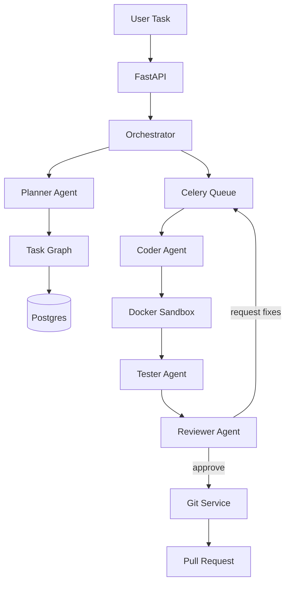

# Architecture

## System Boundary

The framework coordinates AI agents for software engineering workflows. It avoids a single central "AI brain"; the orchestrator is a deterministic application service that controls state transitions, retries, dependency readiness, policy checks, and persistence.

## Layers

```text
API
  FastAPI routes, request/response models
Application
  Orchestrator, reviewer loop, memory service, policies
Domain
  Workflow, Task, Artifact, Review, Memory, Git models
Interfaces
  Repository, AgentClient, TaskQueue, Sandbox, Git, Telemetry, VectorMemory protocols
Infrastructure
  Postgres, Celery/Redis, Docker, GitPython, OpenAI Agents SDK, telemetry adapters
```

## Agent Rules

- Agents are stateless.
- Agents have narrow responsibilities.
- Agents receive typed inputs and return structured JSON.
- Agents never read canonical state directly.
- Agents never mutate the repository or database directly.
- Tool use is mediated by policy and sandbox adapters.

## Workflow

1. User submits a task.
2. Orchestrator creates a workflow.
3. Planner returns a structured task graph.
4. Orchestrator persists the graph and queues ready tasks.
5. Coder performs one coding task through controlled tools.
6. Tester validates the result.
7. Reviewer checks architecture, typing, style, security, performance, hallucinated APIs, imports, and coverage.
8. Rejected work creates a bounded feedback task.
9. Approved work can be committed and opened as a pull request.

## Data Flow



## Race Condition Strategy

The production repository layer should update tasks with compare-and-swap semantics on status and attempt count. Queue workers must re-read task state before execution and refuse invalid transitions.

Current implementation advances dependent tasks after successful task completion and queues tasks whose dependencies are all `SUCCEEDED`. A workflow is marked `SUCCEEDED` only after every task in its graph reaches `SUCCEEDED`.

## Context Corruption Strategy

The orchestrator builds scoped memory for each agent run. Agents do not append to shared context. Summaries and artifacts are persisted as immutable records and injected only when relevant.

## OpenAI Agents SDK Boundary

`OpenAIAgentsSDKClient` creates narrow SDK agents with typed `output_type` schemas and runs them through `Runner.run()`. Tests use deterministic fakes and do not rely on network calls.

The adapter supports per-agent model configuration and retries schema-invalid structured output before raising `AgentOutputValidationError`. Prompts are versioned through `AgentPromptSpec` so agent behavior is auditable.

## Audit Trail

Execution history is append-only through `ExecutionEventRepository`. The orchestrator records workflow creation, planning, reviewer approval, requested fixes, and test pass/fail events when a repository is configured.

## Artifact Storage

Inline agent artifacts can be materialized through `ArtifactStore`. The filesystem adapter stores artifacts under workflow/task scoped content-addressed paths and returns metadata that can be persisted by `ArtifactRepository`.

## Queue Boundary

`CeleryTaskQueue` publishes `ai_orchestrator.execute_task` messages. Worker registration is explicit and currently fails closed until a production composition root is provided.

## Composition Root

`CompositionRoot` wires settings, Postgres sessions, repositories, Celery queue, artifact storage, telemetry, and agent backend selection. Local execution defaults to deterministic fake agents; production should set `AIO_AGENT_BACKEND=openai`.

## API Surface

The backend exposes workflow creation, workflow listing, workflow snapshot, artifact listing, execution history, and approval gate decision endpoints. Route tests override dependencies with deterministic in-memory services so API contracts do not require a live database.

## Telemetry

Telemetry is exposed through a backend-neutral interface with events, counters, and observations. `StructuredLoggingTelemetry` is the local default. `OpenTelemetryAdapter` records counters, histograms, and spans through injected or global OpenTelemetry providers.

## Git Flow

When all tasks in a workflow succeed, the orchestrator can commit changed files through `GitService`. If commit fails, the orchestrator rolls back and marks the workflow failed. Pull request creation is intentionally separate and requires an approved approval gate through `PullRequestService`.

`CompositeGitService` keeps local git operations in `GitPythonService` and delegates pull request creation to a configured provider. `GitHubPullRequestProvider` uses GitHub's REST API and can be tested through an injectable sender without network access.

## Sandbox Workspaces

`SandboxWorkspaceManager` prepares isolated task workspaces by copying the repository without `.git`, caches, local virtualenvs, node modules, or generated artifacts. `SandboxRunService` mounts that workspace into Docker with resource limits and command allowlists. `ExecutionPolicy` requires an explicit workspace mount by default.

## Tool Execution Layer

Agents may return structured tool requests, but they do not execute tools directly. `ToolExecutionService` validates requested tool names against an allowlist, runs them in the prepared sandbox workspace, and stores tool results as artifacts. Non-zero tool results fail the task and workflow before reviewer approval.

## Worker Idempotency

Workers execute tasks through `execute_queued_task()`, which first claims only `QUEUED` tasks. Claiming transitions a task to `RUNNING` and increments `attempt_count`. Already-running or terminal tasks are skipped, preventing duplicate execution during queue retries.
