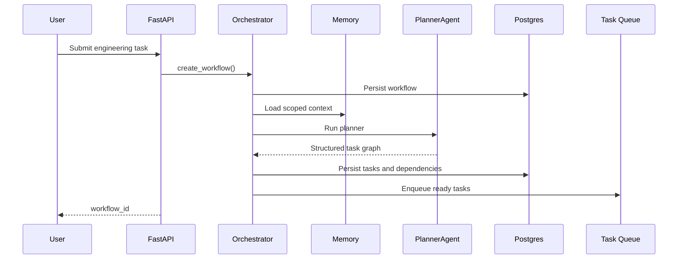
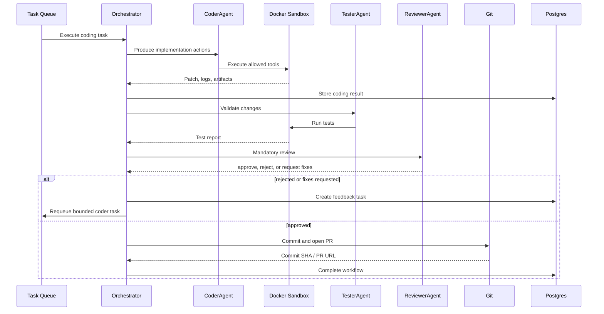

# AI Agent Orchestration Framework Design

## Goal

Build a production-grade AI agent orchestration framework for software engineering workflows. The system coordinates multiple narrow, stateless agents for planning, coding, testing, reviewing, refactoring, documentation, pull requests, and task decomposition. Codex is modeled as a coding worker behind the orchestration layer, not as the central decision maker.

## Architecture Overview

The framework uses clean architecture boundaries:

- API layer: FastAPI application for workflow creation, state inspection, artifacts, approvals, and administrative operations.
- Application layer: orchestration service, state machine, reviewer loop, approval service, memory service, and agent execution coordination.
- Domain layer: workflow, task, artifact, review, memory, git, and event models.
- Infrastructure layer: Postgres repositories, Redis/Celery task queue, Docker sandbox executor, OpenAI Agents SDK client, GitPython adapter, logging, metrics, and tracing adapters.
- Interface layer: Python protocols for repositories, agent client, sandbox, git, queue, telemetry, and vector memory.

Agents are stateless. They receive typed inputs, return structured JSON, and do not read or mutate persistent state directly. The orchestrator loads state, builds agent inputs, validates outputs, persists events, and advances the workflow.

## Directory Tree

```text
src/ai_orchestrator/
  api/
  application/
  config/
  domain/
  infrastructure/
  interfaces/
tests/
  unit/
  integration/
  orchestration/
  contracts/
docs/
```

## Data Flow

```text
User task
  -> FastAPI API
  -> Orchestrator creates workflow
  -> Planner agent decomposes task graph
  -> Tasks are persisted in Postgres
  -> Ready tasks enter Celery queue
  -> Coder agent executes changes through sandbox tools
  -> Tester agent validates changes
  -> Reviewer agent performs mandatory review
  -> Rejected work creates bounded feedback task
  -> Approved work is committed and optionally opened as a pull request
```

## Agent Lifecycle

1. Orchestrator loads workflow and scoped memory.
2. Orchestrator builds a Pydantic input model for the target agent.
3. Agent client runs the typed request through OpenAI Agents SDK or test fake.
4. Agent output is parsed and validated as a Pydantic model.
5. Policy engine validates permissions and requested tool actions.
6. Orchestrator persists agent run, artifacts, and execution event.
7. State machine advances the task or workflow.
8. Queue schedules newly-ready dependent tasks.

## Sequence Diagrams





## Database Schema

Core persistent entities:

- `workflows`: user request, status, branch, base ref, retry policy, timestamps.
- `tasks`: graph nodes with type, status, input, output, attempts, priority.
- `task_dependencies`: directed task dependency edges.
- `agent_runs`: typed input/output, model, status, error, timestamps.
- `artifacts`: generated files, diffs, logs, reports, metadata, content hashes.
- `execution_history`: append-only workflow and task events.
- `memory_records`: short-term summaries, long-term notes, vector references, artifact summaries.
- `review_results`: reviewer decision, findings, required fixes.
- `approval_gates`: human approval checkpoints for sensitive actions.

## Design Decisions

- Use Celery + Redis for the first queue implementation. Temporal can be added later behind the `TaskQueue` protocol.
- Use Postgres as the source of truth. Redis is not canonical state.
- Use OpenAI Agents SDK behind an `AgentClient` protocol and keep deterministic tests on `FakeAgentClient`.
- Use Docker sandbox execution for coding and testing with no secrets mounted, resource limits, timeout limits, and policy-controlled tool permissions.
- Use GitPython behind a `GitService` protocol.
- Keep reviewer mandatory after every coding phase.
- Keep retries bounded and explicit. No infinite autonomous loops.
- Keep prompts versioned and colocated with agent definitions.

## Security Model

- Tool permission system checks requested actions before execution.
- Execution policies define allowed tools, network mode, timeout, CPU, memory, and mount points.
- Approval gates block sensitive operations such as external PR creation or privileged tool use.
- Sandbox containers do not receive host secrets by default.
- Rate limits apply at API and agent-execution boundaries.

## Testing Strategy

- Unit tests for state machine, policy checks, schemas, and service decisions.
- Contract tests for every agent input/output schema.
- Orchestration tests for planner -> coder -> tester -> reviewer -> commit loops.
- Integration tests for database repositories, queue adapter, sandbox adapter, and git adapter.
